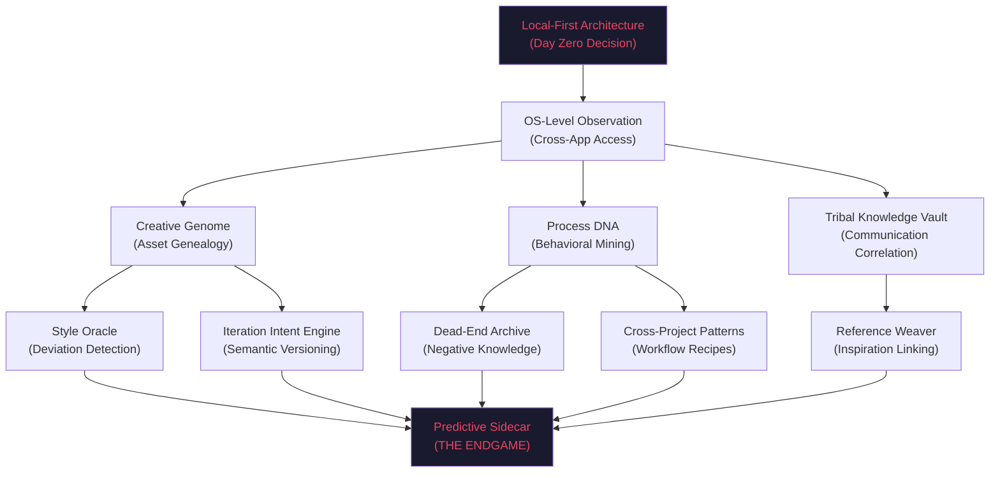

# PMA Future Roadmap: The Path to v1.0

This document consolidates all planned features, technical optimizations, and strategic research frontiers identified during the v0.0.70 architectural audit and subsequent multi-agent design sessions.

---

## 1. Vision & Multimodal Intelligence (v0.0.80 Frontier)
**Goal**: Transition PMA from a "Text-Based Retrieval System" to a "Total Memory Assistant" by indexing visual knowledge (whiteboards, diagrams, screenshots, videos).

### 📸 Image Intelligence
- **CLIP-based Semantic Search**: Integrate `clip-vit-base-patch32` (ONNX) to allow natural language queries over images (e.g., "Find that database schema diagram").
- **Visual Functional Blueprints**: Use **Moondream2** (lightweight VLM) to generate textual summaries of images, enabling standard RAG to "understand" visual content.
- **Local OCR**: Integrate `rapidocr-onnxruntime` for high-speed, local-first text extraction from screenshots and documents.
- **Photo Billboards**: Render high-fidelity image previews as "billboards" within the 3D Crystal Dreamscape.

### 🎥 Video Recognition
- **Scene-based Indexing**: Sample keyframes (e.g., 1 frame every 2-5s) and index them via CLIP to enable jumping to specific visual moments in long videos.
- **Video Summarization**: Generate temporal descriptions of video content for global retrieval.

---

## 2. Advanced RAG & Retrieval Architectures
**Goal**: Eliminate retrieval dead zones and improve p95 latency via "Vectorless" and "Hybrid" strategies.

### âš¡ True Vectorless RAG
- **Identifier Fast-Path (`LEXICAL_FIRST`)**: Bypass embeddings for strict code identifiers, file paths, or error codes. Query SQLite FTS5 directly for 100% accuracy on OOV (Out of Vocabulary) tokens.
- **Lite Search Mode**: A battery-saving "Lexical Only" mode that skips ONNX inference and LanceDB, using strictly SQLite FTS5.
- **Selection-Anchored RAG**: Allow users to "lasso" nodes in the 3D graph. The backend fetches raw text for those specific `chunk_ids` directly via SQL, bypassing vector search for perfect context.
- **1-Hop GraphRAG**: Use the `file_edges` table to deterministically fetch immediate dependencies of a file to answer "What breaks if I change this?".

### 🧠 Hybrid Improvements
- **Metadata Pre-filtering**: Use SQLite to filter by date/type/folder *before* running LanceDB similarity search to radically reduce the search space.
- **Typeahead / Autocomplete API**: Instant (<10ms) UI suggestions using FTS5 prefix matching (`MATCH 'upda*'`) as the user types.

---

## 3. Performance & Core Infrastructure
**Goal**: 3x throughput speedups and military-grade stability.

### 🦀 Rust Core Offloading
- **Rust Stream Chunker**: Port the heavy `StreamChunker` logic from Python to the Rust core using PyO3 to move string allocations and regex scanning to a native layer.
- **Barnes-Hut Octree Layout**: Fully wire the existing O(N log N) physics algorithm into the visualization pipeline to replace the current O(N²) repulsion logic.

### 📡 System Synchronization
- **WebSocket Transition**: Replace SSE (Server-Sent Events) with WebSockets for bidirectional, zero-polling status updates and real-time indexing progress.
- **Vector-Native Deduplication**: Implement LanceDB-native scalar clustering to deduplicate snippets before they reach the Python layer.

---

## 4. UX & OS Integration
**Goal**: Make PMA ubiquitous and effortless to use.

- **Tauri Spotlight (Alt+Space)**: A global, macOS-style quick search bar for instant queries from anywhere in the OS.
- **System Tray Integration**: Persistent tray icon showing indexing status, background health, and quick-toggle for "Lite Mode."
- **Explorer Semantic Search**: Add a search bar to the file tree that uses vector similarity to filter folders and files.
- **Related Files Sidebar**: Real-time suggestions of "proximity files" based on the current active document's vector distance.

---

## 5. Future Tech Watch (Post-v1.0)
**Goal**: Monitor emerging technologies that fit PMA's O(1) memory constraints.

- **BM42 Learned Sparse Retrieval**: Monitor the stability of the 90MB BM42 model via FastEmbed as a potential replacement for the dense vector stack.
- **Contextual Retrieval (LLM-Prepend)**: Evaluate the cost of using a local LLM to prepend document context to every chunk during the indexing phase for 10% higher retrieval accuracy.
- **Nested Volumetric Crystal Graph v2**: Recursive clustering of visualizer nodes to support 1M+ file projects with fluid WebGPU performance.

---

## 6. Vertical Persona Modules (v1.0+)
**Goal**: Transform PMA from a "Search Tool" to a "Cognitive Co-Processor" tailored for specific industries.

### 💻 The Coder Module (Context Tunnel)
*   **Local MCP Server**: Acts as a semantic proxy between the IDE (Cursor, VS Code) and the local codebase.
*   **Hierarchical Symbol Retrieval**: Returns "Maps" of functions and signatures rather than raw text, allowing LLMs to "expand" only what they need.
*   **Stateful KV Cache Pinning**: Storing frequently used code context to eliminate redundant processing.

### 🎨 The Creative Professional Module (Software Hooks)
*   **Software Hooks**: Direct integration via Python APIs for **Houdini, Nuke, Blender, Maya, and Unreal**.
*   **Scene Topology Intelligence**: Real-time understanding of node graphs and 3D project structures.
*   **Proactive "Sidecar" Help**: Volunteers relevant documentation or previous project snippets based on the user's active node or operation.

### 📚 The PKM Enthusiast (Zero-Effort Memory)
*   **Engagement Tracking**: Automatically bookmarks high-weight context nodes based on user "Engagement Time" (e.g., reading/debugging duration).
*   **Auto-Archiving**: Note-taking becomes obsolete; the context is "just there" and organized by importance.

### 🏦 Specialized Industry Verticals (High-Value Niches)
*   **Medical Research**: High-throughput PDF extraction and semantic linking for journals.
*   **Legal/Accounting**: Structured data extraction from XLSX/PDF with deterministic metadata paths for high-stakes retrieval.
# PMA Future Modules & Persona-Specific Capabilities

This document consolidates the planned future modules and specialized capabilities for the Personal Memory Assistant (PMA), as designed during multi-agent brainstorming sessions.

---

## 1. Persona-Specific Modules

### A. The Coder Module (The "Context Tunnel")
*   **Target**: Developers, Software Engineers, AI-assisted coders.
*   **Core Problem**: The "Context Window Limit" of modern LLMs and the latency of sending large codebases.
*   **Key Capabilities**:
    *   **Local MCP Server**: Acts as a semantic proxy between the IDE (Cursor, VS Code) and the local codebase.
    *   **Hierarchical Symbol Retrieval**: Instead of raw text, PMA returns a "Map" of the file (Functions, Signatures, Docstrings).
    *   **On-Demand Expansion**: The LLM only "calls" for the full source code of specific symbols it needs to edit, drastically reducing token usage.
    *   **Out-of-IDE Context**: Provides the AI with access to Slack logs, Jira exports, and browser history for a complete technical picture.

### B. The Creative Professional Module (The "Omni-Context Observer")
*   **Target**: VFX Artists, Game Developers, Technical Directors (Houdini, Nuke, Maya, Blender, Unreal, DaVinci).
*   **Core Problem**: Complex node graphs and scene topologies that are difficult to describe to a standard AI.
*   **Key Capabilities**:
    *   **Software Hooks**: Direct integration via Python APIs of professional creative suites.
    *   **Scene Topology Intelligence**: Real-time understanding of the active project structure (e.g., node connections in Nuke or Houdini).
    *   **Proactive "Sidecar" Help**: Surfaces relevant documentation, math formulas, or previous project snippets based on the active node.
    *   **Real-time Suggestions**: Offers troubleshooting or optimization advice as the user works.

### C. The PKM Enthusiast (The "Zero-Effort Memory")
*   **Target**: Students, Researchers, Knowledge Workers (Obsidian, Notion users).
*   **Core Problem**: The friction of manual note-taking and organization.
*   **Key Capabilities**:
    *   **Passive Engagement Tracking**: PMA monitors "Engagement Time" (e.g., if you spend 5 mins on a specific paragraph, it auto-bookmarks).
    *   **Auto-Archiving**: Automatically organizes and summarizes information based on importance rather than manual filing.
    *   **Invisible Brain**: Note-taking becomes a background process; the context is simply "there" when needed.

---

## 2. Elite Technical Roadmap (v1.0+)

### OS-Level Intelligence Layer
*   **Shift from Pull to Push**: Moving from reactive search (hotkey-driven) to proactive assistance (PMA volunteers context).
*   **Passive Observer**: Monitoring system clipboard, active window titles, and file system events to build a live "Working Memory" graph.

### Stateful Retrieval (R&D)
*   **KV Cache Pinning**: Storing frequently used context in a stateful way to eliminate redundant processing.
*   **Delta Injections**: Only sending the "changes" or "new context" to the LLM instead of the entire history.

### Vertical Niche Expansions (Future Considerations)
*   **Medical Researcher Module**: High-throughput PDF extraction and semantic linking for medical journals.
*   **Legal Paralegal Module**: Case law retrieval and cross-referencing across massive document stores.
*   **Accountant/Financial Module**: Structured data extraction from XLSX/PDF with deterministic metadata paths.

---

## 3. Core Differentiators

| Feature | Standard RAG Tools | PMA "Elite" Vision |
| :--- | :--- | :--- |
| **Interaction** | Manual Search (Pull) | Proactive Surface (Push) |
| **Context** | File-based | Engagement-based |
| **Integration** | Chat Box / Plugin | OS-Level "Cognitive Co-Processor" |
| **Scaling** | Token-limited | Stateful / KV-Cached |
| **Privacy** | Often Cloud-first | 100% Local-First Infrastructure |
# PMA Creative Module (v1+) — Feature & Architecture Blueprint

This document synthesizes the validated killer features and architectural constraints for the PMA Creative Module, incorporating findings from multi-agent design reviews and VRAM constraint research.

## 1. Architectural Foundation

### The Zero-LLM Execution Layer

> [!WARNING]
> **The VRAM Constraint:** Running an 8B local LLM alongside heavy DCC tools (Nuke, Houdini) will steal compute threads and crash rendering workflows.

To maintain PMA's strict O(1) memory and zero-loss performance constraints, the execution architecture is 100% deterministic:

1. **Deterministic MCP Seams:** The LLM does *not* generate Python scripts dynamically. All background processing relies on 0-parameter deterministic code (Python AST/Regex manipulation and SQLite queries).
2. **The LLM as a Chat Router:** The local LLM is confined entirely to the Chat UI. It translates natural language ("Check my comp style") into a deterministic tool call (`run_aesthetic_review()`).
3. **Ambient Triggers:** Features are triggered silently by filesystem events (e.g., `Ctrl+S`) or background queues, ensuring 0% UI interference.

### The Session-Scoped SIMD Sub-Index (turbovec)

> [!IMPORTANT]
> **The 60MB RAM Limit vs. Inference Speed**
> LanceDB is fantastic for $O(1)$ disk-backed global search, but it cannot handle continuous, rapid-fire $O(N^2)$ inferencing (e.g. dozens of queries per second for proactive aesthetic review) without high FFI overhead. To solve this, we use `turbovec` purely as an ephemeral, bounded working memory.

1. **Session Trigger (Discovery):** When a user opens a project in a DCC tool, the Creative Module asks LanceDB to find the Top-N similar past projects based on `folder_profiles`.
2. **Bounded Extraction:** The vectors for *only* those similar projects are extracted and loaded into a temporary `turbovec` RAM instance. A strict physical cap (e.g., `MAX_VECTORS = 25,000`) guarantees memory never exceeds the 60MB limit.
3. **High-Throughput SIMD Inferencing:** While working, the Creative Module blasts background inferences against this RAM-only index. It processes structural and aesthetic comparisons with sub-millisecond latency, allowing real-time proactive workflow augmentation.
4. **Teardown:** Closing the project instantly drops the `turbovec` index, guaranteeing zero memory leaks.

---

## 2. The Killer Features (Validated)

### Feature 1: The Butterfly Effect (Dependency Predictor)
* **Goal:** Prevent artists from breaking downstream renders when modifying upstream assets.
* **Mechanism:** Ambient, Zero-Click. When an artist saves a file (e.g., `metal_texture_v2.sbs`), PMA's file watcher triggers an instantaneous 1-hop GraphRAG SQLite query (`SELECT downstream_files FROM relationships WHERE upstream = ?`).
* **UX:** Only alerts the user via OS notification if an active downstream file is impacted.
* **Resource Cost:** < 5MB RAM, ~2ms CPU time. No LLM invoked.

### Feature 2: The Second Set of Eyes (Aesthetic Review)
* **Goal:** Provide asynchronous, mathematically backed aesthetic auditing against an artist's personal style profile.
* **Mechanism:** Statistical Variance. PMA queries historical values for current node types in the script. The Python sidecar calculates standard deviation (`statistics.stdev`). 
* **UX:** If a current value (e.g., `ColorCorrect.contrast`) deviates by > 2 sigma from the artist's historical average, it is flagged. Processed asynchronously via MCP to prevent DCC main-thread freezing.
* **Resource Cost:** < 10MB RAM. No LLM invoked.

### Feature 3: Asset Alchemy & Procedural Scaffolding
* **Goal:** Intelligently inject historical node graphs and materials into new projects without breaking dependencies.
* **Mechanism:** AST / Regex Substitution. Historical decisions are serialized as JSON/XML blueprints. When scaffolding, PMA uses deterministic string manipulation to inject the blueprint via the DCC's native API.
* **Dependency Sandbox (Safety Check):** Before injection, PMA parses the payload for absolute file paths (e.g., textures) and custom macros. It automatically copies missing dependencies to the local project's `_assets` folder to prevent broken links.
* **Resource Cost:** Minimal. Fast, exact, and 100% reproducible.

### Feature 4: "The Road Not Taken" (Semantic Branching)
* **Goal:** Allow granular undo/redo of specific parameter sets (e.g., lighting) without reverting the entire binary file.
* **Mechanism:** Because PMA tracks parameters independently of the binary file, it can fetch a specific subset of parameters from a previous timestamp (e.g., "Lighting settings from Tuesday").
* **UX:** The MCP connector re-injects these specific parameters into the current scene, merging past lighting decisions with current geometry.

---

## 3. Implementation Prerequisites

To enable these features, Phase 1 of the implementation must ensure that the base format parsers (e.g., `nuke_parser.py`, `houdini_parser.py`) explicitly extract and structure the following metadata into SQLite:

1.  **Dependencies:** Explicit tracking of `Read` nodes, texture references, and linked assets to power the adjacency table for the Butterfly Effect.
2.  **Numeric Parameters:** Extraction of numeric knob/parameter values into a typed format to allow mathematical variance calculations for Aesthetic Review.
3.  **AST Serializations:** Saving the literal node blocks as JSON/string blueprints to enable Procedural Scaffolding.
# PMA Creative Module v1.0+ — Features No One Else Can Build

> [!IMPORTANT]
> These features go **beyond** what's already documented in `FUTURE_MODULES_AND_PERSONAS.md` and `FUTURE_ROADMAP_CONSOLIDATED.md`. They are synthesized from deep research into creative AI gaps, process mining, temporal knowledge graphs, creative provenance tracking, and local-first competitive moats.

---

## The Strategic Premise

Every feature below passes this triple filter:

| Filter | Question |
|---|---|
| **Novelty** | Does any existing tool do this? |
| **Structural Defense** | Does copying this require an architectural/business-model commitment that conflicts with how big companies operate? |
| **Compounding Value** | Does this get MORE valuable the longer you use it, creating a time-dependent moat? |

---

## Feature 1: The Creative Genome — Full Genealogy of Every Asset

### What It Is
A **W3C PROV-O compliant provenance graph** that automatically traces the complete lineage of every creative asset across your entire local filesystem and every application you use. Not just "v1 → v2 → v3" — but the full genealogy:

```
concept_sketch.png (Photoshop, Jan 3)
  ├── exported → base_mesh.fbx (Blender, Jan 5)
  │     ├── sculpted_detail.fbx (ZBrush, Jan 7)
  │     │     └── retopo_final.fbx (Blender, Jan 9)
  │     │           ├── texture_set_A.substance (Substance, Jan 11)
  │     │           └── texture_set_B.substance (Substance, Jan 11) ← ABANDONED
  │     └── rigged_version.ma (Maya, Jan 8) ← SUPERSEDED
  └── ref_used_in → lighting_setup_v3.hip (Houdini, Jan 15)
```

PMA watches the filesystem, detects when a file is derived from another (via timestamps, naming patterns, open-file-handle correlation, and content similarity hashing), and builds this graph automatically. Every node carries:
- **Who** created/modified it (local user or which software)
- **When** (bi-temporal: when it happened + when PMA learned about it)
- **What changed** semantically (not just bytes — "added subsurface scattering")
- **Why** (correlated from Slack messages, review notes, browser history happening at the same time)

### Why It's Novel
**No tool does this across applications at the local filesystem level.** DAMs (Bynder, Canto) track managed assets within their own silo. Figma tracks Figma files. Adobe C2PA tracks within Adobe tools. **Nobody traces how a `.psd` evolves through 47 saves, gets exported to `.png`, is edited in ZBrush, retopologized in Blender, and ends up in Unreal — all while remaining local-first.**

### Why Big Companies Can't Copy It
1. **Data gravity**: Creative files are TB-scale and can't be uploaded to cloud
2. **Cross-application**: Adobe only sees Adobe. Autodesk only sees Autodesk. NVIDIA only sees Omniverse. PMA sees EVERYTHING because it operates at the OS/filesystem level
3. **Requires local-first architecture from day zero** — cloud companies would need to deploy persistent local agents that conflict with their SaaS models
4. **Compounding value**: After 6 months, PMA has a genealogy graph that represents your ENTIRE creative history. A new tool starts at zero

---

## Feature 2: Creative Process DNA — Behavioral Fingerprinting via Process Mining

### What It Is
Apply **process mining** (traditionally used for enterprise business processes) to creative workflows. PMA records every creative action as an event log:

```
[10:03:02] Houdini → Created Scatter SOP
[10:03:15] Houdini → Connected to Grid SOP
[10:03:28] Houdini → Adjusted density parameter (0.5 → 2.3)
[10:04:01] Houdini → Undo (density back to 0.5)
[10:04:12] Houdini → Adjusted density parameter (0.5 → 1.1)
[10:04:45] Browser → Searched "houdini scatter density falloff"
[10:05:30] Houdini → Added Attribute Wrangle after Scatter
[10:05:45] Houdini → Pasted VEX code from clipboard
```

From these logs, PMA extracts your **Creative Process DNA**:

- **Phase detection**: "You spend 40% of time in exploration (high undo frequency), 35% in execution (linear progression), 25% in refinement (small parameter tweaks)"
- **Bottleneck identification**: "You consistently get stuck at UV unwrapping — average 47 minutes vs 12 minutes for other tasks"
- **Workflow signatures**: "When you build particle effects, you always start with Scatter → Wrangle → Copy-to-Points. When you deviate from this pattern, 73% of the time you end up reverting"
- **Cross-session patterns**: "Your most productive creative sessions start with reference gathering (browser), then 2+ hours of uninterrupted DCC work. Sessions that start directly in the DCC have 2.3x more undo operations"

### The Killer Feature Within This Feature
**"Creative Session Coaching"** — PMA detects when you're in an exploration spiral (high undo rate, frequent reference searches, no forward progress for 15+ minutes) and can surface:
- "Last time you hit this pattern on the fire effect project, you solved it by switching to a VDB-based approach. Here are your notes from that session."
- "Your productivity data shows you typically break through creative blocks after a 10-minute break. You've been in this loop for 22 minutes."

### Why No One Can Copy This
- **Requires OS-level process observation** across ALL applications — not possible from a cloud-based chat assistant or single-app plugin
- **Deeply personal data** that artists/studios will NEVER send to a cloud service
- **Requires months of accumulated data** to produce meaningful patterns — a day-one install is useless. This is a pure time-dependent moat
- **Non-linear creative workflows break traditional process mining** — PMA would need to develop creative-specific mining algorithms that treat "deviation as value, not error"

---

## Feature 3: The Tribal Knowledge Vault — Capturing Institutional Memory Before It Walks Out the Door

### What It Is
The #1 unsolved pain point in creative studios: **When senior artists/TDs leave, they take undocumented workflows, workarounds, and "secret sauces" with them.** PMA automatically captures and indexes this tacit knowledge:

1. **Auto-documenting Pipeline Decisions**: When an artist builds a complex node setup, PMA generates documentation explaining not just WHAT was built but WHY (by correlating with concurrent communications, reference materials, and the artist's historical patterns)

2. **"Why Did We Do It This Way?" Archive**: Every significant creative decision gets annotated with context:
   - "We used Arnold instead of RenderMan for this project because [correlated from email thread on Feb 3]"
   - "This Houdini setup uses a custom VEX deformer instead of the built-in one because [correlated from Slack discussion where John explained performance issues]"

3. **Searchable Expertise Graph**: "Show me everything Sarah knew about fluid simulations" → returns her node setups, her workarounds, her reference materials, her chat discussions about fluid sim approaches, and her iteration history on fluid-heavy shots

### Why This Is Defensible
- **Requires indexing across ALL communication channels locally** (Slack exports, email archives, browser history, file changes) — something only a local-first tool with OS-level access can do
- **Trust**: Studios will only give this level of access to a tool that provably never sends data to the cloud
- **Compounding**: A team using PMA for 2 years has an irreplaceable knowledge base. Switching tools means losing all that institutional memory
- **The knowledge being captured is inherently local** — it lives in local files, local chat logs, local project structures. Cloud services literally cannot see it

---

## Feature 4: The Style Consistency Oracle — Real-Time Deviation Detection

### What It Is
PMA indexes your entire project's creative output and builds a **statistical style profile** — understanding the "visual language" of your project:

- Material roughness ranges, color palettes, lighting ratios
- Character proportion patterns, line weights, texture density
- Motion curves, timing patterns, particle behavior ranges

When a new asset is created or modified, PMA compares it against the project's style profile and flags deviations:

```
⚠️ Style Alert: "hero_sword_v3.fbx"
  - Poly density: 12,400 tris (project average for props: 4,200 ± 800)
  - Material roughness: 0.82 (project range: 0.3-0.6)
  - UV texel density: 2048px/m (project standard: 1024px/m)
  
  Similar props in this project:
  → shield_v2.fbx (4,100 tris, roughness 0.45)
  → helmet_final.fbx (3,800 tris, roughness 0.52)
  
  This asset appears to be at a higher fidelity tier than other props.
  Intent? [Hero asset] [Needs reduction] [New standard]
```

### The Deeper Layer: Style Transfer Intelligence
Beyond detection, PMA learns **which deviations were intentional** (hero assets, cinematic close-ups) vs. accidental (artist unfamiliar with project standards). Over time, it builds a nuanced understanding:
- "For hero assets, roughness can be 0.6-0.9"
- "For background props, keep under 2,000 tris"
- "John's assets consistently have 15% higher poly counts — this is his style, not an error"

### Why This Can't Be Replicated
- **Requires indexing your ENTIRE project history** to build the style profile — only a local tool has access
- **Cross-application**: The style profile spans Substance materials + Blender meshes + Unreal lighting setups. No single vendor's tool sees across all of these
- **The style profile IS the project** — it can't be extracted, uploaded, or replicated without the full local asset history
- **No existing tool does this at all.** Current AI can generate assets but cannot evaluate them against YOUR project's specific style. This is the gap between "AI as generator" and "AI as quality guardian"

---

## Feature 5: The Iteration Intent Engine — Understanding WHY, Not Just WHAT

### What It Is
The biggest gap in creative tooling: **no tool understands the semantic meaning of iterations.** Git sees byte changes. DAMs see version numbers. PMA understands INTENT:

```
Version History for "dragon_texture_v7.substance":

v1 → v2: "Initial pass → Added scale detail" 
          [auto-detected: new layer added, 4 new fill nodes]
          
v2 → v3: "Client wanted warmer skin tones in close-ups"
          [auto-correlated: email from client at 2:15 PM mentioning 
          "the dragon feels too cold", artist opened file at 2:47 PM,
          modified HSL values in base color]
          
v3 → v4: "Reverted warmth, director overruled client"  
          [auto-correlated: Slack message from director: "keep it cold, 
          it's a frost dragon", HSL values reverted to v2 range]
          
v4 → v5: "Added ice crystallization effect on scales"
          [auto-detected: new procedural layer, 12 new nodes, 
          reference image from browser: "ice crystal macro photography"]
          
v5 → v6: "Performance optimization for game engine"
          [auto-detected: texture resolution halved, 3 layers merged,
          no visual change detected at in-game camera distance]
          
v6 → v7: "Final approved version"
          [auto-correlated: Frame.io approval notification received]
```

PMA constructs this by:
1. Monitoring file changes (what changed technically)
2. Correlating with concurrent communications (why it changed)
3. Correlating with reference materials accessed (inspiration source)
4. Analyzing the nature of changes (semantic diffing — "color shift" vs "topology change" vs "parameter tweak")
5. Detecting approval/rejection events

### Why This Is Uncopyable
- **The "why" lives across multiple local data sources** — file changes + emails + Slack + browser history + review tools. Only a local OS-level observer can correlate all of these
- **Requires temporal correlation** — matching the TIMING of communications to the TIMING of file changes. This is trivial for a local tool watching everything; impossible for a cloud tool that only sees one data stream
- **The more iterations you capture, the more valuable** — after a year, PMA has a complete "creative reasoning database" that explains every major decision in your project history

---

## Feature 6: The Dead-End Archive — Learning from Abandoned Approaches

### What It Is
Every creative project has dozens of abandoned approaches — experiments that didn't work out. These are typically lost forever (overwritten, deleted, or buried in backup folders). PMA treats them as **first-class knowledge**:

**Automatic Detection of Abandoned Work:**
- File created, modified extensively, then never opened again
- Node graph branch disconnected and left floating
- Render output saved but never referenced in downstream files
- Multiple undo sequences that end in a different approach

**What PMA Captures:**
```
🗄️ Dead-End Archive: "Volumetric Cloud Approach" (Feb 12-14)

  WHAT WAS TRIED:
  → Houdini VDB-based cloud simulation (cloud_sim_v1.hip through v4)
  → 6.5 hours of work across 3 sessions
  → 47 renders generated
  
  WHY IT WAS ABANDONED:
  → Render times exceeded budget (12 min/frame vs 3 min target)
  → [Slack message Feb 14: "VDB clouds too expensive, switching to cards"]
  
  WHAT REPLACED IT:
  → Billboard card approach (cloud_cards_v1.hip)
  → Render time: 0.8 min/frame ✓
  
  LESSONS CAPTURED:
  → VDB clouds look 4x better but are 4x more expensive
  → For distant clouds, cards are indistinguishable
  → VDB approach might work for hero shots with longer render budgets
  
  REUSE POTENTIAL: HIGH
  → If a future project has render budget for VDB, these setups are ready
  → The VEX shader from v3 was particularly good — consider extracting
```

### Why This Is Revolutionary
**Nobody preserves failed experiments systematically.** Version control captures what survived. PMA captures what DIDN'T survive and WHY — creating a "negative knowledge base" that's potentially more valuable than the positive one:

- "Don't try VDB clouds on this hardware — we proved it's too slow in February"
- "We tried ray-marched fog in three different projects. It only worked when the scene had fewer than 10M polygons"
- "This particle setup was abandoned in Project A but is perfect for what you're trying to do in Project B"

### The Competitive Moat
This is **pure local data**. The abandoned files, the correlation with communications, the render time data — all of it lives on local drives. No cloud service can see abandoned local files, correlate them with local chat logs, and extract lessons from failed experiments. And the archive grows more valuable with every project.

---

## Feature 7: Creative Time Travel — Bi-Temporal Project State Reconstruction

### What It Is
PMA maintains a **bi-temporal knowledge graph** of your project state, allowing you to "time travel" to any point in your project's history and see not just the files, but the FULL CONTEXT of that moment:

```
🕐 Time Travel: "Show me the project state on February 14, 3:00 PM"

  ACTIVE FILES AT THAT MOMENT:
  → dragon_model_v5.blend (last modified 2:47 PM)
  → fire_effect_v2.hip (open in Houdini since 1:30 PM)
  → reference_board.psd (unchanged since Feb 10)
  
  CREATIVE CONTEXT:
  → You were working on the fire breathing animation
  → Reference: 3 YouTube videos of flame throwers bookmarked that morning
  → Slack: Discussing timing with animator at 2:30 PM
  → Mood: High iteration speed (low undo rate, many saves)
  
  DECISION LANDSCAPE:
  → The VDB cloud approach had just been abandoned (see Dead-End Archive)
  → Client feedback on dragon color was pending (received Feb 15)
  → You were about to discover the billboard cloud technique (Feb 14, 4:15 PM)
  
  WHAT HAPPENED NEXT:
  → Feb 14 4:15 PM: Switched to card-based clouds
  → Feb 15 10:00 AM: Received client color feedback
  → Feb 15-16: Color revision sprint
```

### Why This Matters
This solves the universal creative problem: **"What was I thinking when I made this decision?"** — but it also enables:
- **Onboarding**: New team members can "time travel" through the project's history to understand how decisions evolved
- **Post-mortems**: Reconstruct the full context of any decision point for retrospectives
- **Creative regression detection**: "The fire effect looked better on Feb 14 before the color change. Let me see what was different"

### Structural Defense
- **Requires continuous local observation** over weeks/months — a cloud tool installed today sees nothing before today
- **The temporal graph IS the moat** — it represents months of accumulated, correlated, multi-source context that cannot be reconstructed after the fact
- **Bi-temporal modeling (event time + system time)** allows PMA to handle late-arriving information: "The client email explaining why they wanted warmer tones arrived Feb 15, but the DECISION was made Feb 14 based on a verbal call"

---

## Feature 8: The Cross-Project Pattern Library — Workflow Recipes That Evolve

### What It Is
PMA recognizes when you've solved a similar problem before — across different projects, potentially years apart — and surfaces the solution automatically:

```
💡 Pattern Match Detected

  CURRENT TASK: Building rain effect in Houdini
  
  SIMILAR PAST SOLUTIONS (ranked by relevance):
  
  1. "Rain System for City Scene" (Project: Noir, Oct 2024)
     → Pop Network + VDB collision detection
     → 92% match to current scene parameters
     → Render time: 4.2 min/frame
     → STATUS: Production-approved
     → [Open setup] [Copy nodes] [View iteration history]
  
  2. "Weather Effects Package" (Project: Storm, Mar 2024)  
     → Different approach: particle instancing
     → 67% match
     → Render time: 1.8 min/frame (faster but less realistic)
     → STATUS: Used for wide shots only
  
  3. "Rain on Window" (Personal R&D, Jun 2023)
     → Completely different technique (SDF-based)
     → Only 34% match but interesting technique
     → Never used in production
     → [View experiment notes]
```

**The Deep Feature: Workflow Recipe Extraction**
PMA doesn't just find similar files — it extracts **reusable workflow recipes**:

```
📋 Extracted Recipe: "Realistic Rain Effect" 
   (synthesized from 3 projects, 7 iterations)

  INGREDIENTS:
  → Emitter: Grid SOP at scene ceiling height
  → Core: Pop Network with gravity + wind forces  
  → Collision: VDB from scene geometry (voxel size: 0.01 for close-up, 0.05 for wide)
  → Splash: Secondary emission on collision (rate: 0.3 per hit)
  → Rendering: Use motion blur (shutter: 0.5), point rendering, NOT geometry
  
  KNOWN PITFALLS:
  → Don't use poly collision — too slow above 1M polys (learned: Project Noir)
  → Wind force above 2.0 breaks physical plausibility (learned: Project Storm)  
  → Point rendering needs min width 0.5px or rain disappears (learned: all 3 projects)
  
  ESTIMATED TIME: 2-3 hours setup, 3-6 min/frame render
```

### Why This Can't Be Copied
- **Requires indexing across ALL your projects over years** — local-only data
- **The recipes improve over time** as PMA sees more variations and outcomes
- **Pitfalls are learned from YOUR specific failures** — not generic documentation
- **Cross-project matching** requires understanding scene topology across different softwares — something only a local multi-app observer can do
- **A cloud company would need your entire project history uploaded** — studios would never do this

---

## Feature 9: The Contextual Reference Weaver — Automatic Inspiration-to-Implementation Linking

### What It Is
PMA automatically links your **reference/inspiration materials** to the **actual implementation they influenced**:

```
🔗 Reference Web for "Ice Dragon Scales Texture"

  INSPIRATION SOURCES:
  ├── Browser: "macro ice crystal photography" (Jan 3, 10:15 AM)
  │     └── 4 images saved to references/ice/ folder
  ├── ArtStation: "Dragon Scale Tutorial by @artist" (Jan 3, 10:45 AM)
  │     └── Bookmarked, spent 12 minutes reading
  ├── YouTube: "Substance Designer Ice Material" (Jan 3, 11:30 AM)
  │     └── Watched 8 of 22 minutes, paused at 6:12 (node setup visible)
  └── Previous project: frost_material_v2.substance (Project: Winter, 2023)
        └── PMA auto-surfaced this when you searched "ice"
  
  IMPLEMENTATION:
  └── ice_scales_v1.substance (created Jan 3, 1:15 PM)
        ├── Color palette matches saved reference images (87% similarity)
        ├── Node structure similar to YouTube tutorial (6:12 timestamp)
        └── Roughness curve adapted from frost_material_v2
  
  EVOLUTION:
  └── 7 iterations over 3 days
        └── Final version diverged significantly from original references
        └── Unique contribution: custom height blend technique not in any reference
```

### The Power Move: "Reverse Reference Search"
Given any asset in your project, PMA can answer: **"What inspired this?"** — tracing back through browser history, saved references, past projects, and even conversations. This is invaluable for:
- **Art direction**: Understanding the influences behind team members' work
- **IP protection**: Documenting that your work is original / properly attributed
- **Creative retrospectives**: Understanding your own creative evolution

### Structural Defense
- **Requires correlating browser history + file system + clipboard + application state** in real-time. Only possible with local OS-level access
- **The reference web grows richer over time** — after a year, PMA has mapped your entire creative influence network
- **Privacy-critical**: Browser history and reference sources are deeply personal. No artist will send this to a cloud service

---

## Feature 10: The Predictive Creative Sidecar — Anticipating Your Next Move

### What It Is
This is the synthesis of ALL previous features into the ultimate capability. PMA doesn't just remember — it **predicts**:

**Based on:**
- Your Creative Process DNA (Feature 2) — how you typically work
- Your Pattern Library (Feature 8) — what you've done before in similar situations
- Your current project context — what files are open, what you just did
- Your reference materials — what you're looking at

**PMA anticipates:**

```
🔮 Predictive Sidecar (low-interruption mode)

  CURRENT: You're building a particle emitter in Houdini
  
  PREDICTION (87% confidence based on your patterns):
  → You'll want to add turbulence next (you do this in 9/10 particle setups)
  → Ready: Your preferred turbulence settings from last 5 projects
  
  PATTERN ALERT:
  → You're about to hit the same performance wall you hit in Project Noir
  → Last time: particle count exceeded 500K → viewport crawled
  → Suggestion: Set display percentage to 10% now (you did this at minute 45 
  last time; doing it now saves ~30 min of slow viewport)
  
  REFERENCE READY:
  → You searched "houdini particle collision" 10 minutes ago
  → Here's the technique you used in Project Storm (it worked well)
  → Here's the technique you tried in Project Noir (it failed — VDB too heavy)
  
  CONTEXT FROM TEAM:
  → Sarah committed a particle optimization HDA yesterday
  → It addresses the exact performance issue you're approaching
  → [View HDA] [View Sarah's commit notes]
```

### Why This Is the Endgame
This is the feature that **makes PMA feel like a cognitive extension rather than a tool.** It's the convergence of:
- Process mining (knowing HOW you work)
- Provenance tracking (knowing your project's full history)
- Temporal knowledge graph (knowing WHEN things happened and why)
- Cross-project pattern matching (knowing what worked before)
- Real-time context awareness (knowing what you're doing RIGHT NOW)

### Why It's Impossible to Copy
**This feature is literally impossible without Features 1-9.** It requires:
1. Months of accumulated behavioral data (time-dependent moat)
2. Cross-application observation (architectural moat)
3. Full project history with semantic understanding (data moat)
4. Local-first trust (business model moat)

A competitor starting today — even with unlimited resources — cannot replicate what PMA knows about a user who's been using it for a year. That's the ultimate moat.

---

## The Moat Stack — Why This System Is Unassailable



### The Five Moat Layers

| Layer | Type | What It Means |
|---|---|---|
| **1. Architectural** | Local-first from day zero | Can't be retrofitted onto cloud-first systems |
| **2. Observational** | OS-level cross-app access | Single-vendor tools can only see their own ecosystem |
| **3. Temporal** | Months/years of accumulated data | A competitor starting today can never catch up to a user's history |
| **4. Trust** | Provably private (no cloud) | Studios won't give this level of access to cloud tools |
| **5. Emergent** | Features 1-9 combine into Feature 10 | The predictive capability is an emergent property of the entire system, not a single feature |

### Why Each Big Company Specifically Cannot Do This

| Company | Why They Can't |
|---|---|
| **Adobe** | Only sees Adobe apps. Business model requires Creative Cloud subscription + data telemetry. Would never build something that works with Blender/Houdini |
| **Autodesk** | Only sees Autodesk apps (Maya, 3ds Max). Doesn't index communications or browser history. Cloud-first architecture |
| **SideFX** | Only sees Houdini. No cross-app observation. Small team focused on simulation, not knowledge management |
| **Foundry** | Only sees Nuke/Katana/Mari. Griptape acquisition focused on AI agents, not personal memory |
| **NVIDIA** | Omniverse is industrial/simulation focused. No personal memory component. Would never build something this intimate |
| **Google/Microsoft** | Business models depend on data collection. Users won't trust them with this level of intimate creative observation |
| **OpenAI/Anthropic** | Cloud-only LLM providers. No local observation capability. No filesystem access. No application integration |

---

## Prioritized Implementation Pathway

> [!TIP]
> These features should be layered, each building on the previous:

### Phase 1: Foundation (v1.0 → v1.2)
- **Creative Genome (Feature 1)**: File system monitoring + provenance graph
- **Reference Weaver (Feature 9)**: Browser history + clipboard correlation
- *These give PMA eyes across the creative workflow*

### Phase 2: Intelligence (v1.2 → v1.5)
- **Process DNA (Feature 2)**: Action logging via software API hooks
- **Style Oracle (Feature 4)**: Statistical style profiling
- *These give PMA understanding of creative patterns*

### Phase 3: Memory (v1.5 → v2.0)
- **Tribal Knowledge Vault (Feature 3)**: Communication indexing + correlation
- **Iteration Intent Engine (Feature 5)**: Semantic versioning + intent correlation
- **Dead-End Archive (Feature 6)**: Abandoned work detection + lesson extraction
- *These give PMA deep contextual memory*

### Phase 4: Synthesis (v2.0 → v2.5)
- **Creative Time Travel (Feature 7)**: Bi-temporal state reconstruction
- **Cross-Project Patterns (Feature 8)**: Workflow recipe extraction + matching
- *These give PMA the ability to connect past and present*

### Phase 5: Prediction (v2.5+)
- **Predictive Sidecar (Feature 10)**: The convergence of everything
- *This gives PMA the ability to anticipate and assist proactively*

---

## Open Questions for Discussion

> [!IMPORTANT]
> 1. **Which creative software should be the first integration target?** Houdini (deepest API, smallest market) vs Blender (open source, largest market) vs Unreal (biggest commercial opportunity)?
> 2. **How aggressive should the OS-level observation be at launch?** Start conservative (file watching only) and expand, or go full Screenpipe-style from day one?
> 3. **Should the Creative Genome be exportable?** This creates portability (good for adoption) but reduces lock-in (bad for moat). Could offer export in W3C PROV-O format but without the behavioral/intent data?
> 4. **Solo artist vs. studio team**: Which is the initial target? Solo artists have lower switching costs but higher trust. Studios have higher value but require IT approval
> 5. **Is there a risk of "creepy factor"?** OS-level observation of browser history, communications, and work patterns could feel invasive. How to make this feel empowering rather than surveillance?
*Iterated from the hybrid architecture research*
*Built around PMA's unique position: the only AI chat that knows your corpus*

---

## The Foundational Insight Before Any Feature

Every other AI chat interface shows you what the AI thinks.
PMA can show you what YOUR DATA says.

That distinction drives every feature in this document.
Claude renders artifacts. Gemini renders charts. Both are showing you 
AI-generated content. PMA can render visualizations that are grounded 
in your actual indexed files — factually anchored, not hallucinated.

This is not an incremental improvement on what other companies do.
It is architecturally impossible for them to replicate without 
requiring users to upload their entire file system to a cloud server.

---

## Feature 1: The Source Confidence Overlay

**What it is:**
Every sentence in a PMA response that is grounded in an indexed 
source gets a subtle inline confidence signal — not just a footnote 
citation but a live heat map overlaid on the response text itself.

High confidence (retrieved from 3+ sources that agree): text renders 
in full opacity with a faint green underline.
Medium confidence (retrieved from 1-2 sources): text renders normally.
Low confidence (inferred by the LLM without retrieval support): text 
renders with a subtle amber tint and a small "AI inference" tag.
No retrieval support (pure LLM parametric knowledge): text renders 
with a dashed underline and "Not from your files" tooltip.

**Why nobody else does this:**
Claude and Gemini cannot do this because they don't have access to 
your indexed corpus. They can't distinguish between what they retrieved 
from your data vs what they invented. PMA can make this distinction 
explicitly and show it visually.

**Why it matters to users:**
The single biggest failure mode of AI assistants is confident 
hallucination. Users can't tell which parts of a response are 
grounded. PMA makes this visible. This is trust infrastructure 
that changes how users relate to AI-generated answers.

**Implementation — zero additional cost:**
The retrieval pipeline already tracks which chunks contributed to 
each answer. The missing piece is mapping chunks to specific 
sentences in the response. Implementation: require the LLM to 
output in a structured format where each claim is tagged with the 
chunk IDs that support it. The frontend applies the visual overlay 
from the tag metadata.

No new dependencies. No additional API calls. One prompt template 
change and one frontend component.

```
System prompt addition:
"For each factual claim in your response, wrap it in:
<claim sources='[chunk_id_1,chunk_id_2]'>claim text</claim>
For inferences not supported by retrieved context, use:
<inference>inference text</inference>"
```

The frontend parser strips the tags and applies visual styling.
The chunk IDs are already available from the retrieval pipeline.

---

## Feature 2: The Live Corpus Delta View

**What it is:**
When PMA answers a question, it shows a real-time "before and after" 
view of which parts of your corpus were accessed to generate this 
answer — and which parts WEREN'T accessed but arguably should have been.

The "were accessed" panel: the 3-5 chunks that contributed to this 
answer, shown with their source files and the specific paragraph.

The "weren't accessed but might matter" panel: 2-3 chunks that 
are semantically adjacent to the query but didn't rank high enough 
to be included. Shown with a "Did I miss something?" label.

The user can click any "might matter" chunk to force it into the 
context and regenerate the answer. This is human-in-the-loop 
retrieval correction — something no other AI chat interface offers.

**Why nobody else does this:**
You can only show "what was retrieved from your corpus" if you have 
a corpus. Claude has no corpus. Gemini has no corpus. Perplexity 
has the web. PMA has your files.

**Why it matters:**
The current failure mode is silent retrieval errors — PMA retrieves 
the wrong chunks, generates a wrong answer, and the user has no 
visibility into why. This feature makes the retrieval process 
auditable and correctable by the user. It turns a black box into 
a glass box.

**Implementation:**
The retrieval pipeline already returns ranked candidates beyond 
the top-k. The "weren't accessed" panel shows the next 3-5 
candidates that didn't make the cut. The "force include" button 
is a re-query with the selected chunk IDs added to the forced 
context via the Selection-Anchored RAG path (already designed in 
PMA's vectorless RAG architecture).

Zero new backend work beyond surfacing the existing candidate list.
One new frontend component — a collapsible source panel that expands 
to show the retrieval context.

---

## Feature 3: The Contradiction Highlighter

**What it is:**
When PMA generates a response, it simultaneously scans your indexed 
corpus for documents that CONTRADICT the answer it just gave. 
If contradictions are found, the response shows a "âš  Contradiction 
in your files" banner with the specific conflicting passages.

Example: User asks "What is the current authentication approach?"
PMA answers from the most recent architecture document.
PMA also finds an older document saying the opposite.
PMA shows BOTH — the answer it's giving AND the contradicting source.

**Why nobody else does this:**
Other AI tools don't have your files. They can't know that your 
March document says one thing and your September document says 
another. PMA does.

**Why it matters:**
This is the Knowledge Immune System feature from the creative module 
document — applied to the chat interface. It prevents the "confident 
wrong answer" failure mode by proactively surfacing contradictions 
the user may not know exist in their own corpus.

For developers: "Which version of this API is current?" with 
contradicting documentation found and surfaced immediately.
For researchers: "What does the literature say about X?" with 
contradicting papers explicitly shown.

**Implementation:**
After the primary retrieval and response generation, run a secondary 
retrieval with the response's key claims as queries, filtered to 
chunks NOT in the primary retrieval set, with a semantic dissimilarity 
threshold (chunks that discuss the same concepts but with opposing 
stances). This is a second LanceDB query — fast and cheap.

The contradiction detection uses PMA's existing semantic search 
with a negation-aware query expansion: if the answer says "X uses 
approach A", search for chunks that say "X uses approach B" where 
B ≠ A. Approximate in implementation but catches the majority of 
real contradictions in personal corpora.

---

## Feature 4: The Temporal Answer Layer

**What it is:**
PMA's responses are aware of WHEN documents were created/modified. 
When answering a question, the response shows a temporal confidence 
signal: "This answer is based on documents from [date range]. 
Your most recent relevant document is [X days] old."

For time-sensitive queries the response renders a mini-timeline 
showing how the answer has evolved across your corpus over time:

"As of [date 1]: [answer based on docs from that period]"
"As of [date 2]: [answer evolved to this]"  
"As of [date 3 — current]: [current answer]"

The user sees not just WHAT their files say but HOW their files' 
answer has changed over time.

**Why nobody else does this:**
This requires: (a) access to your files' creation/modification 
timestamps, (b) the ability to retrieve and compare documents 
across time, (c) the intelligence to show temporal evolution.

Cloud AI tools have none of (a). PMA has all three because the 
Rust file walker already captures mtime for every indexed file.

**Why it matters:**
For anyone working with evolving documentation — developers, 
researchers, writers — the question "what does my corpus say?" 
has different answers at different points in time. Making this 
explicit prevents acting on stale information without realizing it.

**Implementation:**
Add temporal metadata to the retrieval context. When chunks are 
retrieved, group them by creation date range. If a significant 
temporal spread exists (documents from different periods give 
different answers), trigger the timeline rendering mode.

The timeline component uses the existing FTS5 temporal query 
capability — the `modified_at` field is already indexed. Zero 
new indexing work required.

---

## Feature 5: The Personal Pattern Annotator

**What it is:**
When PMA answers a question about code, writing, or any domain 
where you have substantial indexed history, it annotates its 
response with observations about YOUR specific patterns.

Not generic best practices. Your patterns.

"I notice you always use [X approach] for this type of problem 
across your indexed projects. The answer above is consistent 
with your pattern / deviates from your pattern in this way: [Y]."

For code: "Across your 12 indexed Python files, you consistently 
use [pattern X]. The solution above uses [pattern Y] which differs 
from your established approach."

For writing: "Your indexed documents typically use [sentence 
structure X / vocabulary level Y]. This response matches / 
differs from your style."

**Why nobody else does this:**
Pattern recognition across the user's own corpus requires having 
the user's corpus. No cloud tool has this. PMA has indexed 
everything the user has pointed it at.

This is the Personal Style Intelligence feature from the creative 
module documents — applied to the chat interface as a real-time 
annotation.

**Why it matters:**
Consistency is valuable. A developer who has established conventions 
wants answers that respect those conventions. A writer who has a 
voice wants suggestions that match it. Generic AI answers ignore 
personal context. PMA's annotator makes the answer personally 
relevant rather than generically correct.

**Implementation:**
This uses PMA's existing similarity search on the user's indexed 
corpus. After generating the response, extract the key technical 
or stylistic decisions from the response (via a lightweight Gemini 
call or regex patterns). Search the indexed corpus for similar 
decisions. If the user's historical pattern differs from the 
response, generate the annotation.

The annotation is a second Gemini call — but a cheap one using 
gemini-flash with a short focused prompt. Total additional cost: 
<0.01 cents per query. Within the free tier for most users.

---

## Feature 6: The "What You Don't Know" Panel

**What it is:**
Every response from PMA includes a collapsible "Knowledge Gaps" 
panel that shows:

1. Questions related to this query that your indexed corpus 
   CANNOT answer (gap detection via low-confidence retrieval).

2. Terms or concepts that appeared in retrieved documents but 
   that you haven't indexed any deep explanations of.

3. Related topics where your indexed corpus has sparse coverage 
   compared to the breadth of the query.

The panel says: "You asked about X. Your files can answer this 
well. However, your indexed corpus has sparse coverage of: 
[related concept Y], [related concept Z]. You might want to 
add more materials on these topics."

**Why nobody else does this:**
This is the Knowledge Shadow feature from the creative features 
document applied to the chat interface. It requires knowing the 
boundaries of the user's indexed corpus — what they have AND 
what they're missing. Only PMA has both the indexed corpus and 
the ability to detect its own retrieval confidence limits.

**Why it matters:**
The most dangerous knowledge is the knowledge you don't know 
you're missing. PMA makes the gaps in your personal knowledge 
base visible and actionable. This turns PMA from a tool that 
answers questions into a tool that helps users understand the 
completeness of their own knowledge.

**Implementation:**
Gap detection uses the retrieval confidence scores already 
produced by PMA's pipeline. Low-confidence retrievals (high 
L2 distance from query) indicate knowledge gaps. The gap panel 
shows the concepts that produced low-confidence retrievals 
phrased as "your files have limited coverage of: [concept]."

Sparse coverage detection uses the FTS5 document frequency 
for key terms in the query. Low document frequency = sparse 
coverage. This is a metadata query on the existing FTS5 index 
— zero additional compute.

---

## Feature 7: The Inline Concept Map (From Your Corpus)

**What it is:**
When a response involves explaining relationships between concepts, 
PMA renders a concept map that is built from YOUR indexed documents 
— not hallucinated by the LLM.

The concept map shows: entities from your indexed corpus, the 
relationships between them as extracted from your documents, 
the specific source documents for each relationship.

Clicking any node in the concept map opens the specific passage 
in your indexed corpus where that concept appears.

This is the Tier 3 from the hybrid architecture document — but 
implemented correctly using PMA's existing kg_nodes and kg_edges 
tables from the GraphRAG architecture.

**Why this is different from what other companies are building:**
GraphRAG fails on global questions directed at an entire text corpus — RAG struggles with "What are the main themes in the dataset?" because it's a summarization task rather than a retrieval task.

PMA's concept map is not a GraphRAG global query. It's a local 
subgraph extraction — "show me the relationships between the 
concepts in THIS response, as they exist in MY files." This is 
fundamentally different from Microsoft's global GraphRAG and 
doesn't suffer from the hallucination or cost problems of 
LLM-extracted entity graphs.

**Why it matters:**
The dual-mode interaction — chatbot for intent processing and exploration mode for interactive knowledge navigation — enables nuanced natural language query processing alongside semantic relationship exploration.

PMA provides both in one interface without requiring Neo4j, without 
requiring a cloud database, and without any additional API costs. 
The knowledge graph is already built from the user's indexed corpus 
via the kg_nodes/kg_edges tables.

**Implementation:**
The GraphRAG architecture document already defines kg_nodes and 
kg_edges tables with entity relationships extracted at index time. 
The concept map rendering uses React Flow (lazy loaded) to display 
a subgraph centered on the entities in the current response.

The subgraph query is a SQLite query against kg_nodes/kg_edges — 
O(1) lookup by entity name, 1-hop neighborhood extraction. 
Zero LanceDB usage. Zero additional Gemini calls.

---

## Feature 8: Answer Evolution Tracking

**What it is:**
PMA tracks how the answer to a specific question has changed 
across sessions. When you ask a question you've asked before, 
PMA shows a diff between the previous answer and the current one.

"Last time you asked this (3 weeks ago), the answer was [X]. 
Based on your newly indexed files, the answer has evolved to [Y]. 
The change is because you indexed [specific file] on [date]."

The diff view shows what changed, when it changed, and which 
newly indexed files caused the change.

**Why nobody else does this:**
Query history tracking + corpus change tracking + diff rendering 
requires: knowing what you asked before, knowing what files 
changed since then, and correlating the two. Only a local-first 
system with persistent query history and filesystem event 
monitoring can do this. No cloud tool has all three.

**Why it matters:**
For anyone maintaining a knowledge base — developers, researchers, 
analysts — the question "has my understanding of X changed?" is 
critically important. PMA makes the evolution of your personal 
knowledge base visible and traceable.

**Implementation:**
PMA's existing query history storage (chat history in SQLite) 
provides the previous answers. The file modification timestamps 
from the Rust file walker identify which files changed between 
the two query instances. A diff between the two responses 
renders using the `diff` package (~2KB) already identified in 
the rich output architecture document.

The correlation step (which new files caused the answer change) 
uses the retrieval source attribution from Feature 1 — comparing 
which chunks contributed to the old vs new answer.

---

## Feature 9: The Precision Verifier

**What it is:**
For answers that contain specific numbers, dates, statistics, 
or factual claims, PMA automatically shows the exact passage 
in the source document where that specific fact comes from — 
not just which document, but which sentence.

The response renders: "The retention period is 30 days."
Hovering or clicking: shows the exact sentence from the source 
document with the number highlighted, plus the document name, 
page/section, and modification date.

**Why nobody else does this:**
Sentence-level source attribution requires: (a) your documents 
to be indexed, (b) chunk-level retrieval that preserves exact 
source location, (c) sub-chunk highlighting of the specific claim.

Cloud tools that retrieve from the web can sometimes link to 
sources. None of them can highlight the specific sentence within 
your private indexed document that contains a specific number.

**Why it matters:**
Numbers and statistics are the most frequently hallucinated 
content in AI responses. Making every number in a PMA response 
traceable to its exact source passage eliminates the hallucination 
risk for factual claims. For users working with specifications, 
contracts, research papers, or any document where exact numbers 
matter — this is transformative.

**Implementation:**
PMA's chunking preserves source file, chunk index, and character 
offset within the file. Sentence-level attribution requires 
adding sentence offset tracking to the chunker (character start 
and end of each sentence within the chunk). The frontend hover 
effect shows the source passage using these offsets.

This requires one additional field in the chunks SQLite table 
(sentence_offsets as a JSON array) and minor chunker changes.
No new dependencies. No additional API calls.

---

## Feature 10: The Response Mode Selector

**What it is:**
Before or during a response, the user can select what TYPE of 
output they want — not just text formatting but the cognitive 
mode of the response:

**Explain** — standard response, optimized for understanding
**Verify** — response focused on what can be confirmed from 
  your files vs what is LLM inference (Feature 1 maximized)
**Explore** — response that surfaces connections and related 
  concepts you might not have thought to ask about
**Challenge** — response that actively looks for counterarguments 
  and contradictions to the user's implied assumption (steelmanning)
**Distill** — ultra-compact response, key points only, 
  source-attributed

The **Challenge** mode is the most differentiated. No AI chat 
interface actively tries to find counterarguments to the user's 
implicit assumptions. They all try to be helpful by agreeing. 
PMA's Challenge mode is a tool for critical thinking — it 
surfaces the strongest case against what the user seems to believe.

**Why nobody else does this:**
The Challenge mode requires: (a) access to a corpus that might 
contain contradicting views, (b) willingness to surface 
disagreement rather than agreement, (c) technical implementation 
of "find chunks that challenge this assumption."

No cloud AI tool does (b) systematically — they're all trained 
toward helpfulness which tends toward agreement. PMA can implement 
Challenge mode by routing the query through a contrarian retrieval 
path: after the normal retrieval, run a second retrieval explicitly 
searching for chunks that present opposing perspectives.

**Implementation:**
Five system prompt variants corresponding to five modes.
The Challenge mode adds a second retrieval pass searching for 
semantically opposing chunks (high query-chunk semantic similarity 
but high claim-chunk semantic distance — similar topic, 
different conclusion).

One dropdown in the chat interface. Five prompt templates.
The contrarian retrieval uses existing LanceDB infrastructure.
Zero additional API costs for modes 1-4.
Challenge mode: one additional LanceDB query per response — 
negligible cost.

---

## The Cost Analysis — Why These Are Zero Additional Cost

Every feature above uses only:
- Existing SQLite/LanceDB queries (already in the pipeline)
- Existing chunk metadata (already stored)
- Existing kg_nodes/kg_edges tables (already designed)
- Existing mtime/modification data (already captured by Rust walker)
- One additional Gemini Flash call maximum (Feature 5 only — 
  <0.01 cents, within free tier for all users)
- React components with lazy loading (no additional dependencies 
  beyond what the rich output architecture already specifies)

No new models required. No new APIs required. No new storage 
required. No additional cost to users.

---

## What Other Companies ARE Building (And PMA Is NOT Competing With)

To be precise about positioning:

Microsoft GraphRAG: LLM-extracted global entity graphs from 
large document corpora. High cost. High hallucination risk. 
Not personal. Not local. PMA doesn't compete here.

Claude Artifacts: Static generated content (code, visualizations). 
Not from the user's corpus. Not grounded in the user's files. 
PMA's corpus-grounded visuals are different in kind.

Gemini Charts: Generated from data the user provides in the query. 
Not from indexed files. Not persistent. PMA's temporal and 
pattern features are different in kind.

Perplexity Citations: Web source attribution for web-retrieved 
content. PMA's local corpus attribution is different in kind.

NotebookLM: Closest competitor. Grounded in uploaded documents. 
But requires manual upload, lives in the cloud, has no persistent 
index, has no knowledge graph, has no temporal awareness, has no 
pattern recognition across sessions, has no contradiction detection.

---

## Implementation Priority Order

**Immediate (Days 1-3 of rich output work):**
Feature 9 — Precision Verifier. Sub-sentence source attribution. 
Most trusted by technically sophisticated users. Differentiated 
immediately from day one of rich output.

Feature 2 — Live Corpus Delta View. Make retrieval auditable. 
Builds trust. Uses existing candidate list from retrieval pipeline.

**Short term (Week 2):**
Feature 1 — Source Confidence Overlay. The visual trust layer. 
Requires prompt template change + frontend component.

Feature 3 — Contradiction Highlighter. Second retrieval pass 
for contradictions. Knowledge Immune System made visible.

Feature 10 — Response Mode Selector. Five modes, five prompts. 
Challenge mode as the headline differentiator.

**Medium term (Week 3-4):**
Feature 4 — Temporal Answer Layer. Timeline rendering of how 
answers have evolved across document creation dates.

Feature 6 — What You Don't Know Panel. Gap detection from 
retrieval confidence. Knowledge Shadow made explicit.

**Builds on GraphRAG (Post GraphRAG implementation):**
Feature 7 — Inline Concept Map. Uses kg_nodes/kg_edges.
Feature 8 — Answer Evolution Tracking. Query history diff.
Feature 5 — Personal Pattern Annotator. Style recognition.

---

## The Single Sentence That Describes All of This

Other AI tools show you what AI thinks.
PMA shows you what YOUR FILES say, 
where they agree, where they contradict each other, 
what's changed over time, where your knowledge has gaps,
and whether the AI's answer is grounded or invented.

That is not a feature. That is a different relationship 
between a person and their knowledge.

No other company is building this because no other company 
has access to your private indexed corpus without sending 
it to their servers. PMA's architecture makes this possible. 
These features make it visible.
# Research: Vectorless RAG in Personal Memory Assistant

This document outlines the current state and future opportunities for "Vectorless RAG" (relying on lexical search, FTS5, and sparse scoring instead of dense vector embeddings) within the Personal Memory Assistant (PMA) architecture.

## 1. Where Vectorless Retrieval Already Exists

The PMA architecture currently leverages vectorless/lexical retrieval in foundational ways, avoiding unnecessary embedding generation where semantic understanding is not required:

*   **SQLite FTS5 Metadata Store:** The project already utilizes SQLite with the FTS5 extension (`app/storage/db.py`) as a high-speed metadata store. This serves as the bedrock for any vectorless retrieval, allowing full-text search over file paths, extracted tags, and basic chunk text without hitting the vector database.
*   **Exact Match Deduplication:** During the indexing pipeline (`app/indexing/service.py`), exact hash matching and basic lexical comparisons are used to determine if a file has changed, preventing redundant embedding generation (differential O(1) sync).

## 2. True Vectorless RAG
*(Vectorless retrieval directly feeds the LLM context window)*

### A. Identifier Fast-Path (Code Identifiers)
*   **The Opportunity:** Dense embeddings often fail to find specific code identifiers (e.g., `calculateAnnualYield`, `auth_middleware_v2`) because tokenizers split them into meaningless subwords.
*   **Vectorless Application:** Introduce a `LEXICAL_FIRST` route. When a query contains obvious code identifiers or file paths, the system queries the existing SQLite FTS5 store directly, merging the exact-match results with semantic results.

### B. Lite Mode (Low-Resource Fallback)
*   **The Opportunity:** Running LanceDB and cross-encoder rerankers on older hardware drains battery and consumes excessive RAM.
*   **Vectorless Application:** Introduce a `settings.search_mode = "lexical"` opt-in setting that skips embedding generation and LanceDB entirely, routing all queries strictly through FTS5 lexical search.

### C. Hex/Error Code Hard-Matching (The Debugging Path)
*   **The Opportunity:** Subword tokenizers break apart hex codes (e.g., `0xDEADBEEF`) or standard error constants (`ERR_CONNECTION_RESET`), destroying their mathematical representation in the vector space.
*   **Vectorless Application:** Use regex on the frontend/router to detect strict error formats or hex codes. When detected, bypass semantic RAG entirely and execute a pure vectorless FTS5 query against extracted code chunks, eliminating hallucinations during debugging.

### D. Selection-Anchored RAG (Dreamscape to LLM)
*   **The Opportunity:** When a user lassos/selects a cluster of crystals in the 3D visualization and asks a question, doing a vector search is redundant and inaccurate.
*   **True Vectorless RAG:** The frontend passes the exact `chunk_ids` of the selected 3D nodes. The backend executes a direct SQLite O(1) lookup to fetch the raw text of those files and feeds them straight to the LLM context window. Zero vector similarity used.

### E. 1-Hop GraphRAG (AST Dependencies)
*   **The Opportunity:** When asking "What breaks if I change X?", semantic search fails to find structural dependencies.
*   **True Vectorless RAG:** Utilizing the pre-calculated `file_edges` table, the system uses SQLite to find all immediate dependents (1-hop) of file X. It fetches their text via SQL and feeds them to the LLM. (Constrained to 1-hop to guarantee deterministic O(1) database latency).

### F. Inventory & Temporal Q&A
*   **The Opportunity:** Queries like "List all my python controllers" or "What did I work on yesterday?" require exact matching, which cosine similarity is notoriously bad at.
*   **True Vectorless RAG:** Using fast regex-based intent routing (`/list all|what did i work on/i`), the system bypasses vectors and uses SQLite FTS5 (`LIKE '%controller%'`) or temporal filtering (`updated_at > X`) to fetch the exact chunk summaries, feeding the precise inventory list to the LLM.

## 3. Hybrid RAG
*(Vectorless metadata filtering precedes dense vector search)*

### G. Pre-filtering Gatekeeper (Metadata Shrinking)
*   **The Opportunity:** Running a LanceDB similarity search over the entire codebase is inefficient if the user's prompt contains hard metadata constraints (e.g., "in the past week", "in the python files").
*   **Vectorless Application:** Extract metadata constraints using a lightweight zero-shot classifier or regex, then use SQLite to generate a deterministic list of `chunk_ids`. Pass these IDs to LanceDB as a pre-filter array to radically reduce the vector search space.

## 4. Retrieval for Navigation (Search/UI)
*(FTS5/SQLite is used for instant UI feedback, bypassing the AI engine)*

### H. Real-Time Typeahead & Autocomplete
*   **The Opportunity:** Running an embedding model on partial keystrokes (e.g., `upda...`) as the user types in the search bar yields mathematically useless vectors and creates severe UI latency.
*   **Vectorless Application:** Build a `/api/search/typeahead` endpoint that utilizes SQLite FTS5 prefix matching (`MATCH 'upda*'`) against a constrained table of file names, folder paths, and extracted AST symbols for instant (<10ms) UI feedback.

### I. Conversation History Lookup
*   **The Opportunity:** Semantic search over past chat logs often retrieves "conceptually similar" conversations rather than the exact conversation the user remembers typing.
*   **Vectorless Application:** Create a dedicated FTS5 index for the user's local prompt history. Because users rely on episodic memory (remembering the exact words they used), lexical keyword lookup yields much higher accuracy than semantic similarity.

### J. Crystal Dreamscape 3D Pipeline Optimizations
*   **Topic-Specific Crystals (Subset Streaming):** Currently, the WebGPU renderer receives the entire graph. By exposing an FTS5 `query` parameter (e.g., "auth"), the backend can stream a purely lexical, vectorless subset of nodes to the WebGPU renderer, resulting in <10ms visual filtering without vector embeddings.
*   **Vectorless Structural Edges:** Instead of calculating structural similarity at runtime, file dependencies sharing identical AST identifiers can be pre-calculated during the indexing phase (`file_edges` table). This provides deterministic, vectorless topological context to the 3D visualization stream while preserving O(1) memory limits.
