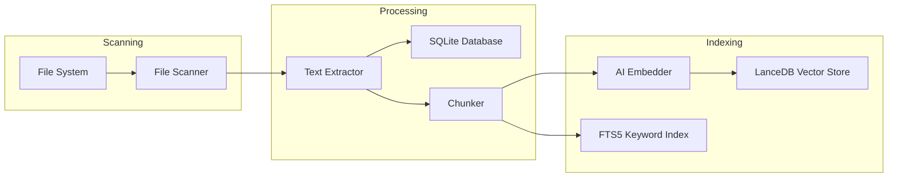
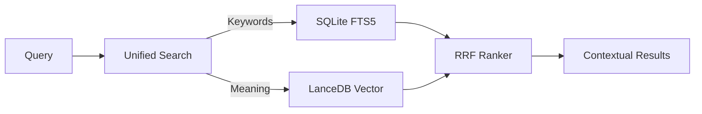

# Personal Memory Assistant (PMA)
### Local-First Semantic Search & Intelligence Engine

[](https://github.com/Binitpyro/Personal_Memory_Assistant)
[](https://www.python.org/)
[](https://www.rust-lang.org/)
[](https://react.dev/)
[](https://tauri.app/)

Personal Memory Assistant (PMA) is a high-performance, local-first search and retrieval system. It indexes your documents and projects with near-zero latency, allowing you to perform semantic queries and gain structural insights without your data ever leaving your machine.

---

## 1. Project Structure

```text
├── app/                # Python Backend (FastAPI, Extraction, RAG)
├── frontend/           # React 19 Frontend & Tauri Desktop Shell
├── prompts/            # AI System Templates (RAG Logic)
├── scripts/            # Automated Development & Build Tooling (Windows)
```

---

## 2. Technology Stack

- **Frontend**: React 19 (Vite), TypeScript, TailwindCSS v4
- **App Shell**: Tauri v2 (Rust-based native shell)
- **Backend**: FastAPI (Python 3.12), Pydantic v2
- **Storage Layer**:
    - **Metadata**: SQLite (FTS5 for keyword search)
    - **Vector Store**: LanceDB (High-performance O(1) semantic retrieval)
- **Extraction**: Rust-powered parallel file walker & stream extractor
- **Models**: Sentence-Transformers (Local embedding generation)
- **Spatial Engine**: WebGPU-powered GPGPU compute for real-time indexing & Volumetric Visualization

---

## 3. Getting Started

### 3.1 Prerequisites
- **Python 3.12+** (Managed via `uv` recommended)
- **Node.js 20+**
- **Rust Toolchain** (Latest stable)

### 3.2 Quick Start (Windows)
For the most streamlined experience on Windows, use the provided scripts:

1. **Launch Development Environment**:
   ```powershell
   ./scripts/StartPMA.bat       # Starts Backend + Frontend + Tauri Shell
   ```

### 3.3 Manual Installation (Cross-Platform)
1. **Initialize Backend**:
   ```bash
   uv sync
   cd app/scanner/rust_core && maturin develop --release
   ```
2. **Initialize Frontend**:
   ```bash
   cd frontend && npm install && npm run build
   ```

---

## 4. Development & Automation Scripts

The `scripts/` directory contains tools to automate the development lifecycle.

| Script | Purpose |
| :--- | :--- |
| `StartPMA.bat` | **Primary Entrypoint**. Starts the full stack in development mode. |
| `Run-Tests.bat` | Executes the full test suite (Python, Rust, and Frontend). |
| `Build-Exe.bat` | Packages the application into a standalone Windows executable. |
| `Reindex-Embeddings.bat` | Resets and regenerates the LanceDB vector store. |
| `dev.bat` | Launches the Vite development server for the frontend. |

---

## 5. Configuration

PMA uses a `.env` file in the root directory for critical configuration. See `.env.example` for details.

```env
# Example .env configuration
GEMINI_API_KEY=your_key_here
LOG_LEVEL=INFO
DATABASE_PATH=./data/pma.db
LANCEDB_PATH=./data/lancedb
```

---

## 6. Architecture

### 6.1 Ingestion Pipeline
The system reads files in streams to ensure scalability without exceeding memory limits.



### 6.2 Unified Search Flow
The system uses **Reciprocal Rank Fusion (RRF)** to combine traditional keyword matching with deep semantic search.



---

## 7. License
Distributed under the **MIT License**.

---

**P.S.** The Nested Volumetric Crystal Graph serves as a high-performance **3D Treemap alternative**, providing recursive spatial depth for project structure visualization without the occlusion and scaling limits of traditional 2D/3D tiling methods.

**Binit Varghese**  
[GitHub Profile](https://github.com/Binitpyro)         
Project: [Personal Memory Assistant](https://github.com/Binitpyro/Personal_Memory_Assistant) 
