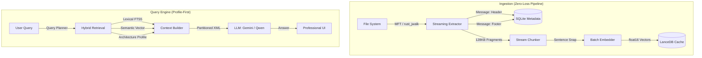

# Personal Memory Assistant (PMA)
### Professional-Grade, Local-First Knowledge Retrieval Engine

[](https://github.com/binit/personal_memory_assistant)
[](https://www.python.org/)
[](https://tauri.app/)
[](https://lancedb.com/)
[](https://opensource.org/licenses/MIT)

## 1. System Overview

Personal Memory Assistant (PMA) is a high-performance, local-first RAG (Retrieval-Augmented Generation) system designed for absolute data sovereignty. It transforms unindexed local folders into a semantically aware knowledge graph without data ever leaving your hardware.

---

## 2. Architecture & Data Flow



---

## 3. Technology Stack

| Layer | Implementation |
| :--- | :--- |
| **Backend Core** | Python 3.12, FastAPI, Pydantic v2 (Strict Typing) |
| **Native Shell** | Tauri v2 (Rust), PyInstaller Sidecar |
| **High-Speed I/O** | Rust Core (PyO3), jwalk, Rayon Parallelism |
| **Vector Engine** | LanceDB (Differential Boot Sync) |
| **Metadata & FTS** | SQLite (WAL Mode), FTS5 |
| **Neural Search** | Sentence-Transformers (BGE-Small-v1.5) |
| **3D Visualization** | WebGPU (Compute Shader Culling, Adler32 Hashing) |

---

## 4. Getting Started

### 4.1 Prerequisites
- **Python 3.12+**
- **Node.js 20+**
- **Rust Toolchain**
- **LM Studio** (Optional: For local LLM execution)

### 4.2 Installation (Foolproof)

1.  **Clone Repository**
    ```bash
    git clone https://github.com/binit/personal_memory_assistant.git
    cd personal_memory_assistant
    ```

2.  **Environment Setup** (Using `uv` for 10x faster dependency resolution)
    ```bash
    uv venv
    source .venv/bin/activate  # Windows: .venv\Scripts\activate
    uv sync
    ```

3.  **Frontend & Native Synthesis**
    ```bash
    cd frontend && npm install && npm run build && cd ..
    cd app/scanner/rust_core && maturin develop --release && cd ../../..
    ```

---

## 5. Usage

### 5.1 Data Ingestion (CLI)
Index any local path using the pipelined streamer:
```bash
uv run pma --index "D:/Documents/Research"
```

### 5.2 Intelligent Retrieval (CLI)
Query the system with architectural awareness:
```bash
uv run pma --query "Explain the security model of the streaming pipeline"
```

### 5.3 Desktop Application (Production)
Launch the professional Tauri interface:
```bash
cd frontend
npm run tauri dev
```

---

## 6. License & Contact

Distributed under the **MIT License**.

**Binit Varghese**
[GitHub Profile](https://github.com/binit)
Project: [Personal Memory Assistant](https://github.com/binit/personal_memory_assistant)
