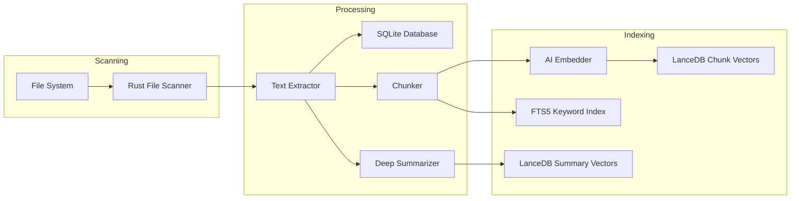
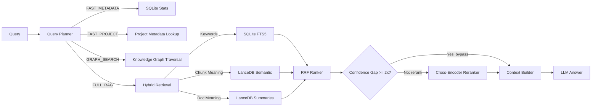

# Personal Memory Assistant (PMA)
### Local-First Semantic Search & Intelligence Engine

[](https://github.com/Binitpyro/Personal_Memory_Assistant)
[](https://www.python.org/)
[](https://www.rust-lang.org/)
[](https://react.dev/)
[](https://tauri.app/)

Personal Memory Assistant (PMA) is a high-performance, local-first search and retrieval system. It indexes your documents and projects with near-zero latency, allowing you to perform semantic queries and gain structural insights without your data ever leaving your machine.

---

## 1. Project Structure

```text
├── app/                # Python Backend (FastAPI, Extraction, RAG)
├── frontend/           # React 19 Frontend & Tauri Desktop Shell
├── prompts/            # AI System Templates (RAG Logic)
├── scripts/            # Automated Development & Build Tooling (Windows)
```

---

## 2. Technology Stack

- **Frontend**: React 19 (Vite), TypeScript, TailwindCSS v4
- **App Shell**: Tauri v2 (Rust-based native shell)
- **Backend**: FastAPI (Python 3.12), Pydantic v2
- **Storage Layer**:
    - **Metadata**: SQLite (FTS5 for keyword search)
    - **Vector Store**: LanceDB (High-performance O(1) semantic retrieval; separate tables for chunk embeddings and document-summary embeddings)
- **Extraction**: Rust-powered parallel file walker & stream extractor
- **Models**: ONNX Runtime and tokenizers for local embedding generation and cross-encoder reranking
- **AI Providers**: Gemini, OpenAI, Anthropic, Groq, OpenRouter, NVIDIA NIM, Ollama, LM Studio, and generic OpenAI-compatible endpoints
- **Spatial Engine**: WebGPU-powered GPGPU compute for real-time indexing & Volumetric Visualization

---

## 3. Getting Started

### 3.1 Prerequisites
- **Python 3.12+** (Managed via `uv` recommended)
- **Node.js 20+**
- **Rust Toolchain** (Latest stable)

### 3.2 Quick Start (Windows)
Copy the example configuration, then choose the development workflow you need:

1. **Create local configuration**:
   ```powershell
   Copy-Item .env.example .env
   ```
2. **Launch browser-mode development**:
   ```powershell
   ./scripts/StartPMA.bat       # Starts the FastAPI backend and Vite frontend
   ```
3. **Launch the Tauri desktop app**:
   ```powershell
   cd frontend
   npm run tauri dev
   ```

### 3.3 Manual Installation (Cross-Platform)
1. **Initialize Backend**:
   ```bash
   uv sync --all-extras
   cd app/scanner/rust_core && maturin develop --release
   ```
2. **Initialize Frontend**:
   ```bash
   cd frontend && npm install && npm run build
   ```

### 3.4 Credentials

PMA reads configuration from `.env` and checks the operating system keyring for
provider API keys. Enter API keys during onboarding or in **Settings → Providers**;
PMA stores those keys in the OS keyring by default. A provider API key set in `.env`
takes precedence and is managed outside the UI, so it cannot be changed or deleted
from Settings.

---

## 4. Development & Automation Scripts

The `scripts/` directory contains tools to automate the development lifecycle.

| Script | Purpose |
| :--- | :--- |
| `StartPMA.bat` | Starts the FastAPI backend and Vite frontend for browser-mode development. |
| `Run-Tests.bat` | Executes the full test suite (Python, Rust, and Frontend). |
| `run_ci_checks.bat` | Runs the project's lint, type, test, and security checks. |
| `Build-Exe.bat` | Builds the legacy PyInstaller sidecar executable; this standalone EXE workflow is temporarily on hold and is not a current release artifact. |
| `Reindex-Embeddings.bat` | Resets and regenerates the LanceDB vector store. |
| `dev.bat` | Launches the Vite development server for the frontend. |

### Testing and CI

```powershell
./scripts/Run-Tests.bat       # Full Python, Rust, frontend, and E2E test suite
./scripts/run_ci_checks.bat   # Lint, type, test, and security checks
```

To run the frontend test suite directly:

```powershell
cd frontend
npm run test
```

---

## 5. Configuration

PMA uses a `.env` file in the root directory for critical configuration. See `.env.example` for details.

```env
# Example .env configuration
PMA_HOST=127.0.0.1
PMA_PORT=8000
PMA_LOG_LEVEL=INFO
PMA_LANCEDB_MODE=portable
PMA_DB_PATH=data/pma_metadata.db
PMA_LANCEDB_PERSIST_DIR=data/lancedb
PMA_GEMINI_MODEL=gemini-2.5-flash-lite

# Optional: an API key here overrides the OS-keyring value for this provider.
# PMA_GEMINI_API_KEY=your_gemini_api_key_here
```

See [`.env.example`](.env.example) for all supported provider and indexing settings.

---

## 6. Packaging

Tauri is the supported desktop distribution path. Build the Windows MSI installer with:

```powershell
cd frontend
npm run tauri build
```

`Build-Exe.bat` still creates a PyInstaller sidecar executable, but that standalone
EXE workflow is temporarily on hold and should not be used as a current release artifact.

---

## 7. Architecture

### 7.1 Ingestion Pipeline
The system reads files in streams to ensure scalability without exceeding memory limits. Each file is chunked for keyword/semantic indexing and independently distilled into a structural summary that gets its own embedding, giving retrieval a document-level signal alongside chunk-level ones.



### 7.2 Unified Search Flow
A query planner first classifies intent into one of four modes: fast metadata/project lookups bypass retrieval entirely, graph-intent queries traverse the knowledge graph, and everything else runs the full RAG pipeline. FULL_RAG fuses three signals — keyword matching (SQLite FTS5), chunk-level semantic search, and document-summary semantic search — via **Reciprocal Rank Fusion (RRF)**, then applies a cross-encoder reranker for maximum precision, automatically bypassed when the top result's confidence decisively clears the runner-up.



---

## 8. License
Distributed under the **MIT License**.

---

**P.S.** The Nested Volumetric Crystal Graph serves as a high-performance **3D Treemap alternative**, providing recursive spatial depth for project structure visualization without the occlusion and scaling limits of traditional 2D/3D tiling methods.

**Binit Varghese**  
[GitHub Profile](https://github.com/Binitpyro)         
Project: [Personal Memory Assistant](https://github.com/Binitpyro/Personal_Memory_Assistant) 
